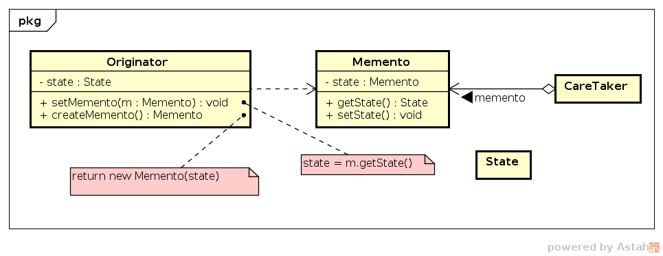

# Memento

## Intenção

Armazenar o estado de um objeto para que possa ser restaurado se necessário.

## Motivação

Em algumas aplicações é necessário armazenar o estado interno do objeto. Isto 
é necessário, por exemplo, em operações em que o usuário deseja desfazer 
comando executados, retrocedendo a um estado anterior.

Podemos manter um registro dos estados usando o padrão `Memento` (recordação), 
que é um objeto que armazena um instantâneo do estado interno de outro objeto - 
o *originador* (`Originator`) do `Memento`.

No exemplo, o `Originator` cria o `Memento` e salva seu estado nele e armazena 
seu objeto em uma lista de `Memento`s em `CareTaker`. Os `Memento`s são 
acessados pelos seus índices. 

## Estrutura

## Participantes

- *Memento* (`Memento`)
    - armazena o estado interno do objeto originator.
- *Originator* (`Originator`)
    - cria um memento contento seu estado interno corrente.
- *CareTaker* (`CareTaker`)
    - é responsável por cuidar do `Memento`.