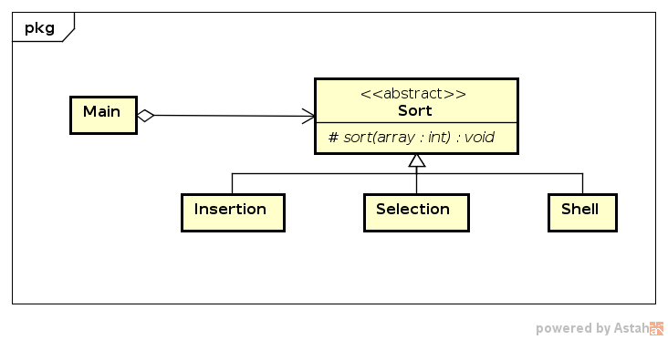
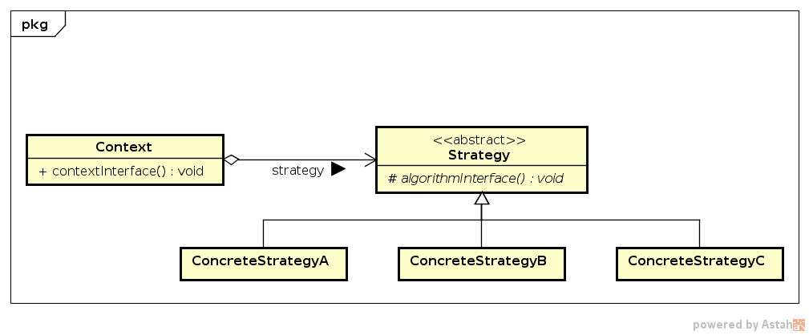

# Strategy

## Intenção 

Define uma família de algoritmos intercambiáveis para que os clientes 
possam utilizar.

## Motivação

O desempenho dos algoritmos de ordenação têm forte dependência 
do tamanho e distribuição da entrada de dados. Uma estrutura flexível 
para que o algoritmo utilizado possa ser modificado conforme a entrada 
de dados pode ser aproveitar do padrão `Strategy`.

No exemplo, temos a classe abstrata `Sort` que fixa o método `sort()` para 
ser utilizados pelos clientes. As classes `Insertion`, `Selection` e `Shell` 
implementam os algoritmos _insertion_ _sort_, _selection_ _sort_ e _shellsort_,
respectivamente.

No cliente (`Main`) a classe a ser instanciada é escolhida dinamicamente, e 
a ordenação executada é aquela implementa na classe escolhida.

## Structure

## Participantes

* *Strategy* (`Sort`)
    - define uma interface comum para todos os algoritmos suportados.
* *ConcreteStrategy* (`Insertion`, `Selection`, `Shell`)
    - implementa o algoritmo usando a interface de `Strategy`.
* *Context*(`Main`)
    - é configurado com um objeto `ConcreteStrategy`;
    - mantém uma referência para um objeto `Strategy`.
