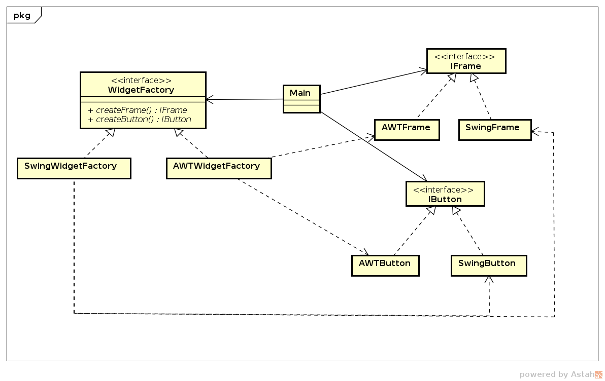

# Abstract Factory

## Intenção

. Fornecer uma interface para criação de objetos relacionados sem especificar
suas classes concretas.

## Motivação

Vamos supor que queiramos implementar um _toolkit_ de interface de usuário 
que possa alternar entre os pacotes Swing e AWT da linguagem Java. 
Especificando diretamente a classe a ser usada torna difícil a alternância e 
as modificações.

Resolvemos este problema com uma interface `WidgetFactory` que declara os 
métodos para a criação das _widgets_. Cada pacote implementa `WidgetFactory` 
e implementa o método de construção da _widget_. A construção das _widgets_ 
obedecem regras impostas na interface correspondente. Por exemplo, `SwingFrame`
 implementa os métodos especificados na interface `IFrame`.

Há uma subclasse concreta em `WidgetFactory` para cada pacote. Os cliente 
só não interagem com as classes concretas, somente com os métodos da 
interface, permitindo que haja uma extensão adicionando outros pacotes 
de `Widget`, se existirem.

## Estrutura

## Participantes

- *Abstract Factory* (`WidgetFactory`)
    - declara um interface para métodos que criam objetos de produtos abstratos.
- *Concrete Factory* (`AWTWidgetFactory` e `SwingWidgetFactory`)
    - implementa as operações que criam objetos de produtos concretos.
- *AbstractProduct* (`IFrame`, `IButton`)
    - declara uma interface para um tipo de objeto de produto.
- *ConcreteProduct* (`SwingFrame`, `SwingButton`, `AWTFrame`, `AWTButton`)
    - define um objeto de produto a ser criado pela sua correspondente 
        fábrica.
- *Client*
    - usa os métodos da interface `WidgetFactory`.