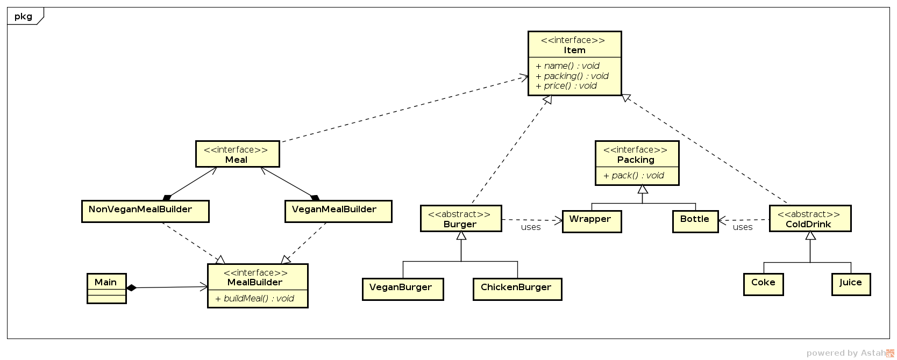
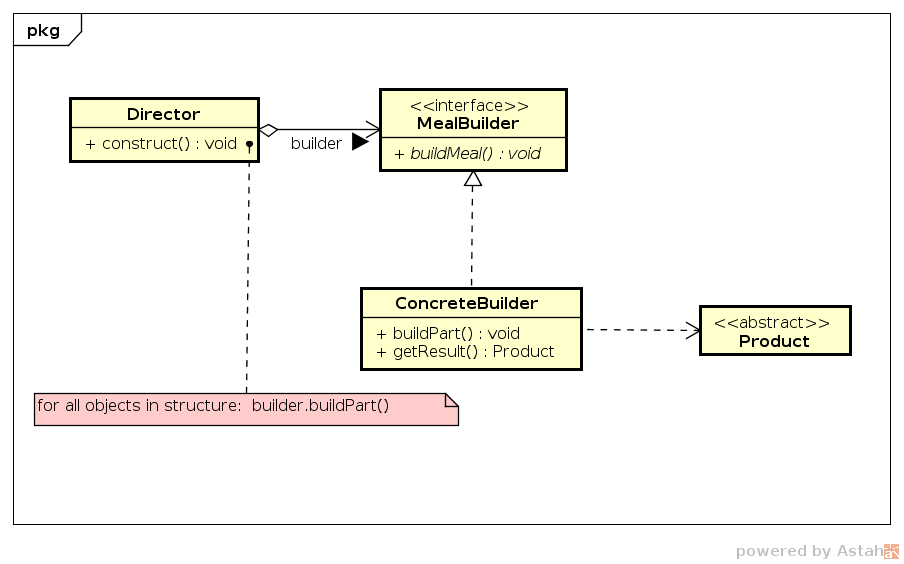

# Builder

## Intenção

Permite produzir diferentes tipos e representações de um objeto usando o mesmo
processo de construção.

## Motivação

Quando os objetos são complexos e requerem inicialização passo-a-passo de 
vários campos e objetos aninhados. Tal código normalmente colocado dentro 
de um construtor com muitos parâmetros, ou pior, no código do cliente. 

Por exemplo, vamos pensar em criar uma classe Refeição (`Meal`) para um 
_fast-foot_ e inserir todas opções do cardápio, contendo lanches e bebidas. 
Poderíamos criar subclasses com todas as combinações de parâmetros. Porém, a 
cada novo item (`Item`) no cardápio haverá a necessidade de aumentar ainda mais 
a hierarquia.

Um construtor com todos os parâmetros poderia ser criado, porém, com o tempo 
haveria muitos parâmetros não usados, tornando o construtor deselegante.

Com o uso do _Builder_, criamos a classe `MealBuilder` e as especializações 
de construção para cada prato, onde o normal (`NonVeganMealBuilder`) 
monta o prato com hamburger e coca e o vegano (`VeganMealBuilder`) monta 
o prato com lanche vegano e suco.

## Estrutura

## Participantes

- *Builder* (`MealBuilder`)
    - especifica uma interface abstrata para criação de partes de um 
      objeto-produto.
- *ConcreteBuilder* (`NonVeganMealBuilder`, `VeganMealBuilder`)
    - constroi e mantém partes do produto;
    - define e mantém a representação que cria;
    - fornece uma interface para recuperação do produto.
- *Director* (`Director`)
    - constroi um objeto interface usando a interface de `Builder`.
- *Product* (`NonVeganMeal`, `VeganMeal`)
    - representa o objeto complexo em contrução.
