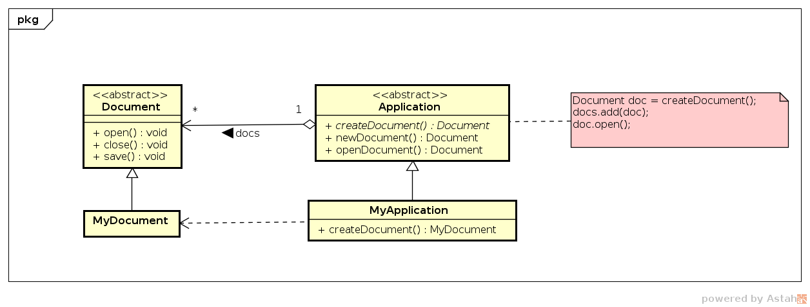
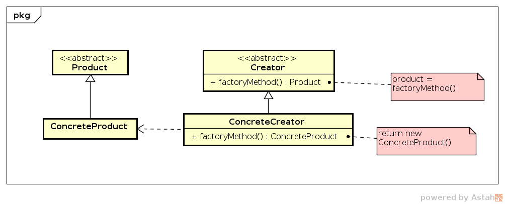

# Factory Method

## Intenção

Definir uma interface para a criação de objeto, mas deixar a subclasse 
decidir qual classe instanciar.

## Motivação

_Frameworks_ usam classes abstratas para definir e manter relacionamentos 
entre objetos. Um _framework_ também é responsável por criar estes objetos.

Considere um _framework_ que apresente múltiplos documentos para o usuário. 
Duas abstrações chaves são as classes `Document` e `Application`. Ambas são 
abstratas, e possuem clientes que realizam implementação de acordo com 
os requisitos específicos para cada aplicação em `MyApplication` e para 
cada documento em `MyDocument`.

A aplicação `Application` não tem conhecimento aos métodos de uma implementação
específica de documento e não pode ser instanciada por ser abstrata. O padrão 
_Factory_ _Method_ vem solucionar este problema encapsulando o conhecimento 
 de qual subclasse de documento criar e movendo este conhecimento fora do 
_framework_.

## Uso

- Quando uma classe não consegue antecipar qual classe instanciar;
- Quando uma classe quer que suas subclasses especifiquem os objetos a 
serem criados.

## Estrutura

## Participantes

- *Product* (`Document`)
-- Define a interface dos objetos da fábrica.
- *ConcreteProduct* (`MyDocument`)
-- Implementa a interface do `Product`.
- *Creator* (`Application`)
-- Declara o método fábrica que retorna o objeto do tipo `Product`. 
   O criador também define uma implementação padrão para o método fábrica.
- *ConcreteCreator* (`MyApplication`)
-- Sobrescreve o método fábrica para retornar uma instância de um 
 `ConcreteProduct`.