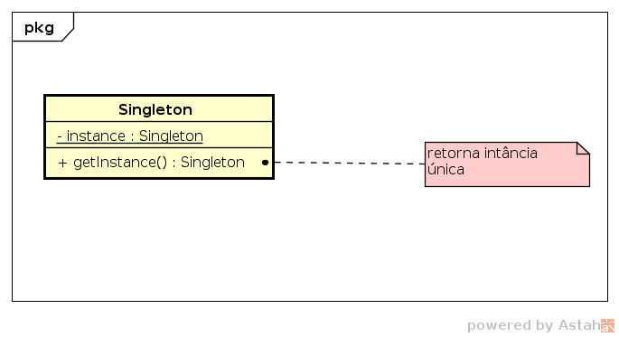

# Singleton

## Motivação

Para algumas classes é importante ter somente uma instância para poder 
gerenciar recursos em um único local. Por exemplo, um sistema pode ter 
várias impressoras mas um único _spooler_ de impressão, como pode ter um 
único gerenciados de janelas, sistema de arquivos e assim por diante.

## Intenção

Assegurar que uma classe tenha somente uma instância e fornecer um acesso 
global a esta instância.

## Uso

O padrão Singleton pode ser usado quando:

- há exatamente uma instância da classe e esta deve estar acessível pelos
clientes de um ponto bem conhecido.

## Estrutura

## Código

[Singleton.java](Singleton.java)