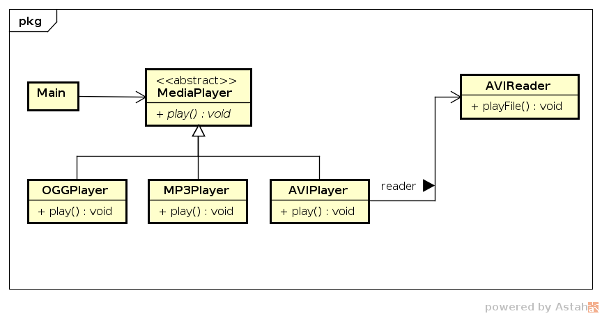
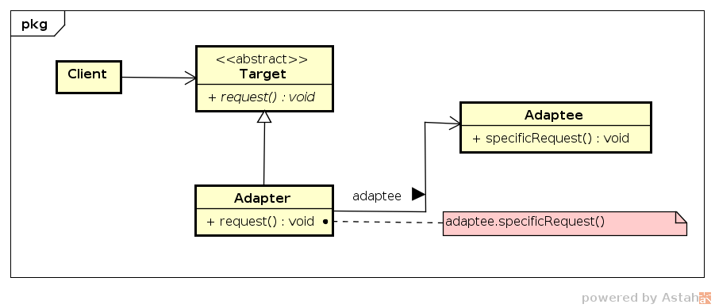

# Adapter

## Intenção

 Converter uma interface de uma classe em outra interface, esperada pelos 
clientes, permitindo que classes com interfaces incompatíveis trabalhem em 
conjunto.

## Motivação

Considere o desenvolvimento de uma aplicação de leitura de arquivos de 
mídias digitais, tais como músicas e vídeos. A interface da aplicação 
é definida em `MediaPlayer` (`play()`). Desenvolvemos os manipuladores dos 
formatos mp3 e ogg. Para o formato avi será utilizada outra implementação 
(`AVIReader`) com uma interface diferente (`playFile()`);

Há a necessidade de implementar um adaptador, `AVIPlayer`, para fornecer 
uma interface compatível com a do projeto. A classe `AVIReader` possui uma
instância de `AVIPlayer` convertendo as solicitações de `play()` para 
`playFile()`, garantindo compatibilidade.

## Estrutura

## Participantes

- *Target* (`MediaPlayer`)
    - define a interface que o cliente irá usar.
- *Client* (`Main`)
    - usa os objetos compatíveis com a interface de `Target`.
- *Adaptee* (`AVIReader`)
    - interface que precisa ser adaptada.
- *Adapter* (`AVIPlayer`)
    - adapta a interface de `Adaptee` à interface de `Target`.
