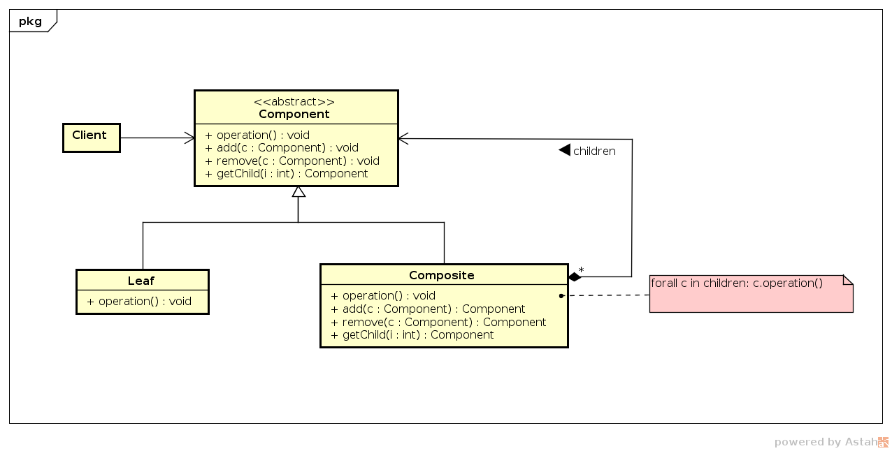

# Composite

## Intenção

Permitir compor objetos em hierarquia parte-todo através da representação 
de árvores.

## Motivação

Aplicações que possuem muitos componentes como as aplicações gráficas, exigem 
a manipulação eficaz destes componentes. Se quisermos manipular uma figura 
que possua vários elementos como texto, reta, linha, retângulo, fica 
desconfortável e trabalhoso aplicar as operações principais separadamente
em cada um deles.

A solução é ter uma interface abstrata para padronizar as ações para estes 
elementos, sendo que todos os elementos herdam as operações desta 
classe abstrata. Dentra as classes que herdam o comportamento, uma fica 
responsável por manipular todos os elementos, centralizando as ações.

Na Figura a seguir a classe `Graphic` especifica os métodos a serem herdados, 
e `Picture` é a classe que irá gerenciar os objetos primitivos. Para desenhar 
uma figura (`Picture`), basta adicionar (`add()`) elementos (`Text`, 
`Rectangle` ou `Text`) e executar a operação principal em `Picture` (`draw()`).
 Esta ação percorre todos os elementos primitivos da figura e executa o 
metodo `draw()` de cada um deles. 
 

## Estrutura

## Participantes

- *Component* (`Graphic`)
    - declara a interface para os objetos na composição;
    - declara uma interface para gerenciar os seus componentes-filhos.
- *Leaf* (`Rectangle`, `Line`, `Text`)
    - define comportamento para objetos primitivos na composição. Uma folha 
        não tem filhos.
- *Composite* (`Picture`)
    - armazena a coleção dos componentes-filhos;
    - define o comportamento para os componentes que têm filhos;
    - implementa as operações relacionadas com os filhos presentes 
        na interface.
- *Client* (`Main`)
    - manipula os objetos na composição usando a interface de `Component`.
